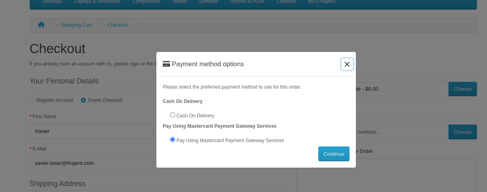
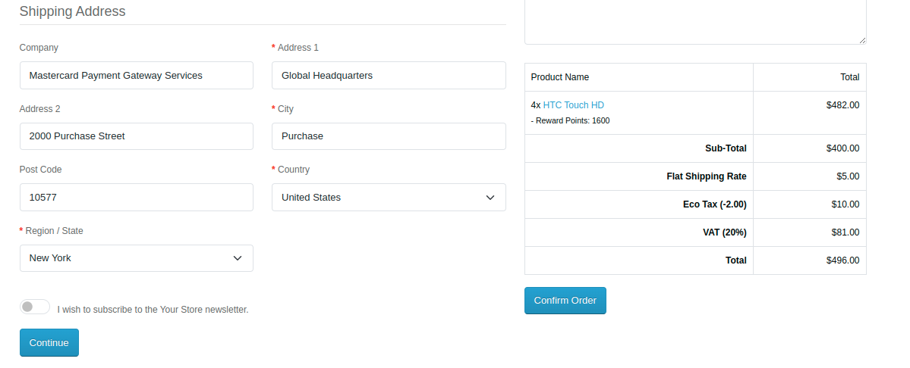
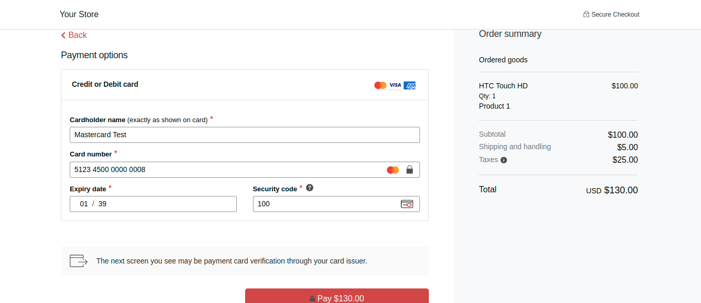
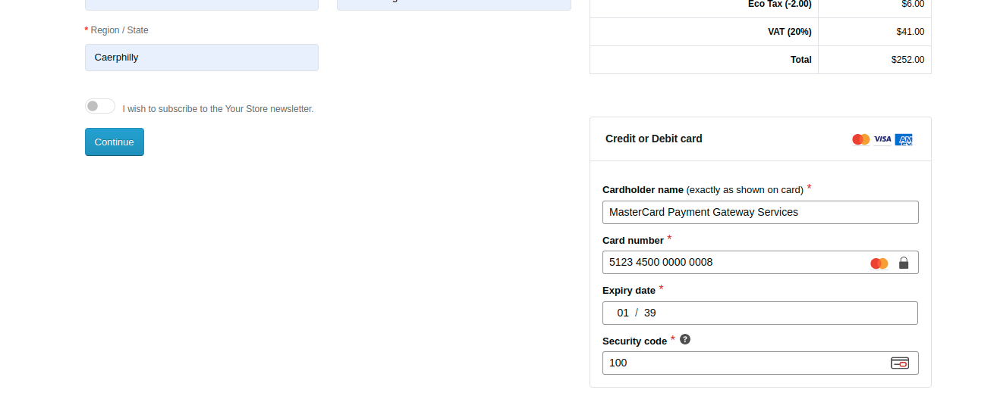
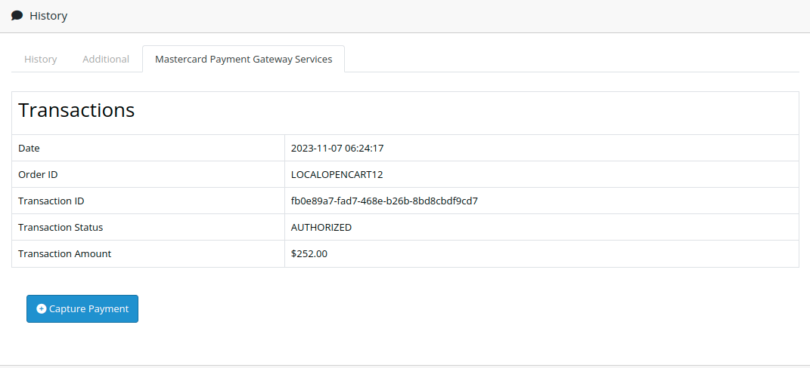
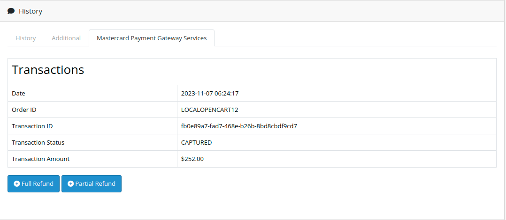

# Mastercard Payment Gateway Services  for OpenCart

This plugin adds Mastercard Payment Gateway Services as a payment option on your OpenCart checkout page.

## System Requirments

The latest release of the plugin has the following system requirements:

- PHP version 8.0 or higher is mandatory.
- OpenCart version 4.0.2.3 or later is required. However, we strongly recommend using the latest available version of OpenCart for optimal performance.

## Documentation

Click here to access the documentation: https://mpgs.fingent.wiki/target/opencart-mastercard-payment-gateway-services/installation/

## Support

For customer support: https://mpgsfgs.atlassian.net/servicedesk/customer/portals

## Compatibility

Version v1.3.0
- Enhanced Compatibility: Compatible with PHP 8.1 & Opencart 4.0.2.x (tested with v4.0.2.3).
- Updated Mastercard API Version to 73.
- Added Payment Capture Option.
- Added Refund Option.
- Added Partial Refund Option.

## Installation
1. Make a backup of your site before applying new mods etc.
2. Go to Admin → Extensions → Installer and upload the downloaded .ocmod.zip file.
3. After uploading the OpenCart Module, you'll find it in the 'Installed Extensions' list. Simply use the '+' button to install the module.
4. Navigate to the "Payments" section by going to Admin → Extensions and choosing "Payments" from the extension type dropdown.
5. Search for the extension labeled "Mastercard Payment Extension" in the list and activate the module installation by clicking the plus symbol.

## Configuration
Please proceed with the following actions to configure the payment method:

1. Log in to your OpenCart administration application.
2. Go to Extension > Extensions.
3. From the extension type filter, choose Payments.
4. Scroll down until you find the 'Mastercard Payment Gateway Services' extension, and click on the Edit button.
5. Fill up the forms with all required fields.
6. After completing all required fields, click the 'Save' button to save the configurations. Once the form is successfully saved, it will redirect you to the 'Extensions' page.

## Hosted Payments

### Payment Gateway Selection

Choose 'Pay Using Mastercard Payment Gateway Services' from the list.

Clicking the 'Confirm Order' button triggers the secure payment form, where customers can safely enter their card information.

### Redirect Payment Page

Users will be directed to a secure page to enter their card details.

### Embedded Payment Form

A secure payment form is presented directly on the checkout page, allowing customers to input their card details and submit the form to place an order.

### Capture Transaction

To capture the order, navigate to the 'Mastercard Payment Gateway Services' within the 'History' section on the order details page, and then click the "Capture" button.

### Refund / Partial Refund Transactions

When the order has been captured successfully, the "Refund" and "Partial Refund" buttons will be visible to the admin on the order details page.

